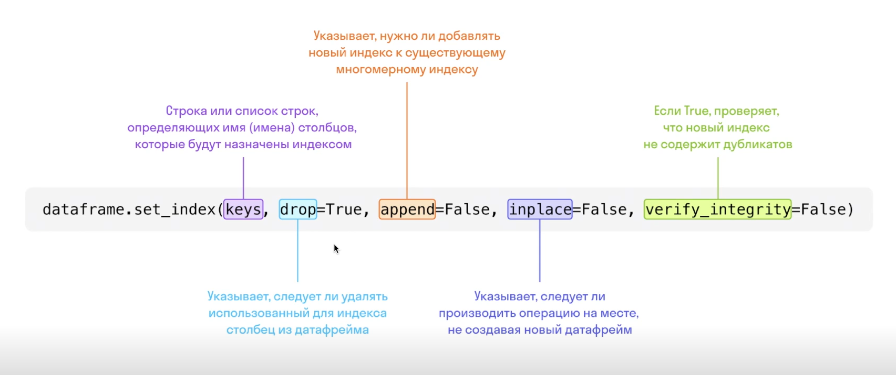
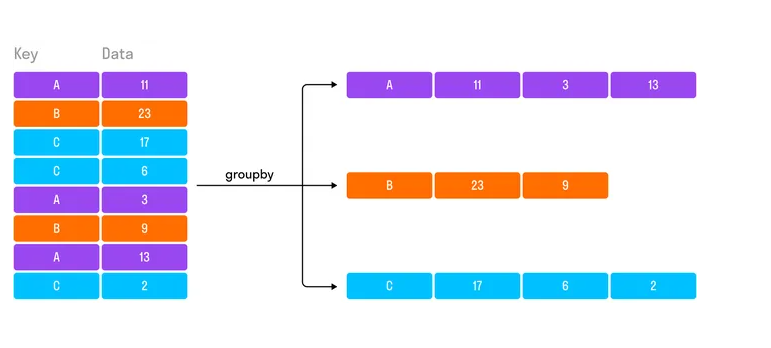
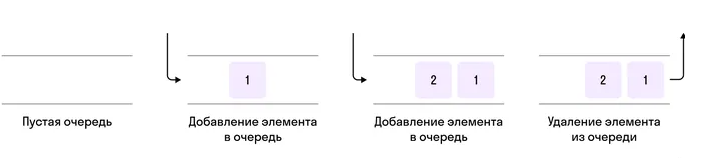
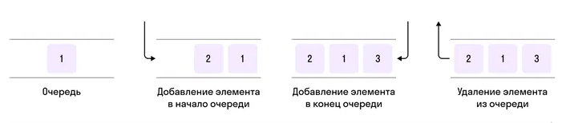
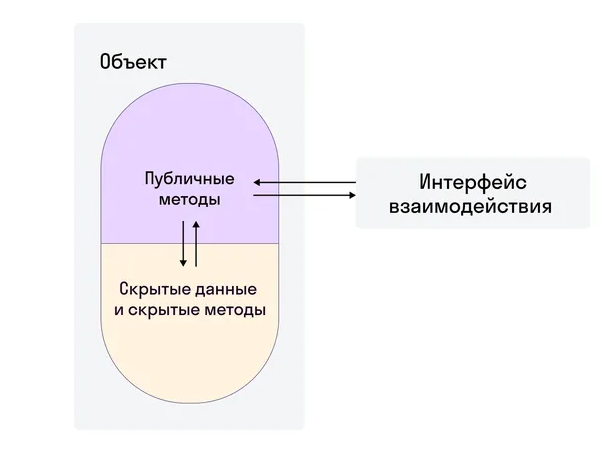
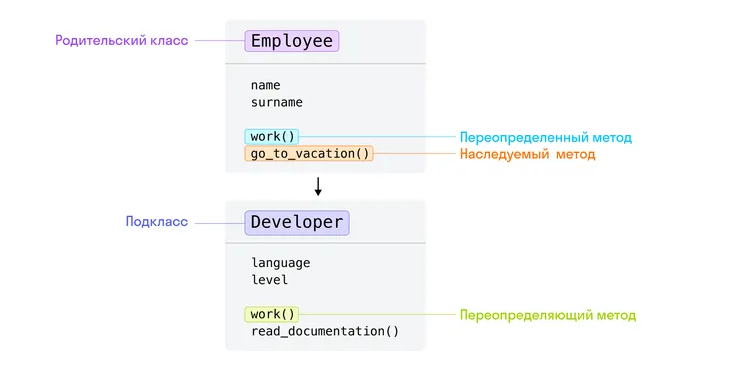

# Термины в IT, взятые с Skypro

# содержание:
- [Основные термины](#основные-термины)
- [1. Основы алгоритмизации](#1-основы-алгоритмизации)
- [2. Типы данных](#2-типы-данных)
- [3. Списки](#3-списки)
- [4. Циклы](#4-циклы)
- [5. Строки](#5-строки)
- [6.1 Словари](#61-словарии)
- [6.2 Базовые функции](#62-базовые-функции)
- [7.1 Продвинутые функции](#71-продвинутые-функции)
- [7.2 Множества, кортежи и вложенные коллекции](#72-множества-кортежи-и-вложенные-коллекции)
- [8.1 Установка программ](#81-установка-программ)
- [8.2 Модули и пакеты. Организация собственного проекта](#82-модули-и-пакеты-организация-собственного-проекта)
- [9.1 Poetry. Оформление кода](#91-poetry-оформление-кода)
- [9.2 Основы Git](#92-основы-git)
- [10.1 Продвинутый Git](#101-продвинутый-git)
- [10.2 Тестирование. Pytest](#102-тестирование-pytest)
- [11.1 Включения и генераторы](#111-включения-и-генераторы)
- [11.2 Декораторы](#112-декораторы)
- [12.1 Библиотеки json, requests и datetime](#121-библиотеки-json-requests-и-datetime)
- [12.2 Библиотека logging](#122-библиотека-logging)
- [13.1 Библиотеки csv и pandas](#131-библиотеки-csv-и-pandas)
- [13.2. Библиотеки re, collections, random](#132-библиотеки-re-collections-random)
- [14.1 Введение в ООП](#141-введение-в-ооп)
- [14.2 Режимы доступа](#142-режимы-доступа)
- [15.1 Магические методы](#151-магические-методы)

# Основные термины 
-	***Фулстек (фулстек-разработчик)*** — специалист, который отвечает за все этапы разработки: как фронтенда, так и бэкенда.
-	***Продакт-менеджер*** — определяет стратегию развития проекта, контролирует реализацию новых фичей (функций) и работу всей команды.
-	***Frontend/web-разработчики*** — работают с той частью сайта, которую видит пользователь. Стиль, шрифты, расположение иконок и кнопок. Еще они делают разные версии сайта для смартфона и компьютера. Эти ребята в основном используют язык JavaScript.
-	***Backend-разработчик*** — работает с тем, что «под капотом». Это внутренняя кухня, логика сайта, скрытая от пользователя. Мы называем это «серверная часть». Здесь работают на языках Python, Java, PHP.
-	***Дизайнер*** — создает визуалы для нашего продукта: рисует картинки и кнопки, которые потом добавляет на сайт фронтендер.
-	***Тестировщик (QA)*** — проверяет, всё ли работает правильно. Он проходит весь путь пользователя, нажимает на все кнопки, вводит данные во все поля, чтобы найти баги (ошибки), и передает отчеты обратно в команду, чтобы мы доработали продукт. Нам важно, чтобы пользователь не столкнулся ни с какими ошибками.
-	***Аналитик данных*** — собирает статистику: какие функции пользователи используют, а какие нет; какие кнопки есть у конкурентов, что сейчас нужно на рынке. Они делают отчеты о посещаемости сайта и думают, что стоит улучшить. Потом передают информацию продакт-менеджеру — и он запускает весь процесс снова.
-	***Синтаксис (в программировании)*** — это набор правил, которые объясняют, как писать код на том или ином языке. Они показывают, как располагать и сочетать команды, какие использовать символы, как структурировать записи и так далее.
-	***Стартап*** — это коммерческий проект, основанный энтузиастами на какой-то идее и требующий финансирования для развития. Задача стартапа — вырасти в бизнес.
-	***Интерпретатор (в программировании)*** — это программа, которая выполняет код, написанный на языке программирования. Ее устанавливают на компьютер, чтобы удобно работать с кодом.
-	***Тренажер*** — это имитация реального приложения для написания Python-кода у нас на платформе.
-	***Клиент-серверная архитектура*** — это отношения, в которых одна программа — ***клиент*** — делает запросы, а другая — ***сервер*** — принимает и обрабатывает их.
-	***Браузер*** (Chrome, Firefox, Safari) — это программа на компьютере или смартфоне, которая предлагает строку поиска, избранное, закладки, историю.
-	***Клиент*** — программа, которая отправляет запросы серверу, получает ответ и взаимодействует с пользователем.
-	***Сервер*** — программа, запущенная на мощном компьютере, которая принимает и обрабатывает запросы.
-	***Грейд*** — это уровень профессиональных знаний и навыков.
-	***Таск-трекер*** — инструмент для управления задачами и разработкой.
-	***Спринт*** — период рабочего времени, на который берется некое количество задач. Обычный срок спринта составляет неделю.
-	***Итеративный подход*** — подход в разработке, когда конечная цель достигается множеством сравнительно коротких итераций, то есть постепенно, по шагам.
-	***Словарь*** — одна из основных структур данных в Python, где каждому ключу соответствует значение. Словари удобны для хранения связанных значений: например, имя пользователя и его ID. Или ФИО и должность сотрудника.
-	***Функция*** — своего рода "мини-программа" внутри программы. Там, где ее вызывают, она делает что-то определенное, например, подсчитывает сумму чисел или выводит текст на экран.
-	***Цикл*** — способ сделать что-то много раз. Например, печатать каждый элемент списка или повторять какое-то действие 10 раз.
-	***Условный оператор*** — способ сделать одно или другое действие в зависимости от какого-то условия. Его можно представить как ответ на вопрос "да" или "нет". Например, если ответ на вопрос "Сегодня выходной?" является "да", то условный оператор может сказать "сделай что-то", а если "нет", то "сделай что-то другое".

#	1. Основы алгоритмизации
-	_**Блок-схема**_ — форма записи любого алгоритма, где каждому шагу соответствует определенный блок.
-	**_MVP (minimum viable product — минимально жизнеспособный продукт)_** — самая простая версия продукта (сервиса), которая не стоит много ресурсов, но уже полезна пользователям, и мы можем проверить нужность продукта.
-	**_Алгоритм_** — последовательность действий, которая приводит к известному результату.
-	**_Псевдокод_** — это упрощенный язык программирования, используемый для иллюстрации алгоритма. Он отличается от обычного кода тем, что написан языком, который понятен человеку.

#	2. Типы данных
-	**_Функция_** — это именованная часть кода, которая выполняет определенную задачу. То, что мы передаем в функцию внутри скобок, называется аргументом.
-	**_Переменная_** — это ячейка в памяти компьютера, у которой есть имя и в которой хранятся данные.
-	**_Деление нацело (//)_** — производит деление одного числа на другое, оставляя только целую часть от получившегося результата.
-	**_Остаток от деления (%)_** — производит деление одного числа на другое, возвращая только дробную часть от получившегося результата.
-	**_Возведение в степень (**)_** — возводит число слева от оператора в ту степень, которая указана справа.
-	**_Инкремент (+=)_** — увеличение значения переменной. У этой операции различное поведение в зависимости от типа данных, к которому она применяется.
-	**_str (string)_** — строка, т. е. набор символов.
-	**_int (integer)_** — целые числа. Например, 1, 5, 10, 100 и т. д.
-	**_float_** — дробное**** число, или число с плавающей точкой.
-	_**Тип None**_ представляет собой специальное значение, которое обозначает отсутствие конкретного значения. Используется, когда переменной не присвоено какое-либо значение.
-	**_Конкатенация_** — операция, которая «суммирует» строки друг с другом.
-	**_Функция round()_**  — округляет число с плавающей точкой до знака, который вы указываете.

#	3. Списки
-	**_Список_** — это тип данных list, представляющий собой упорядоченный набор элементов.
-	**_Функция_** — самостоятельная единица в Python, которая выполняет какие-то определенные действия.
-	**_Метод_** — часть другой функциональности Python (например, метод append — часть списков), которая выполняет определенную функцию
-	**_Функция len_** — это встроенная функция Python, которая используется для определения количества элементов (длины) списка.
-	**_Метод extend_** — применяется к списку и используется для объединения двух списков. Метод принимает в качестве аргумента другой список и добавляет все его элементы в конец вызывающего списка. Этот метод изменяет исходный список.
-	**_Метод append_** — применяется к списку и используется для добавления нового элемента в конец списка. Этот метод изменяет исходный список, добавляя элемент, переданный в качестве аргумента, в его конец.
-	**_Срез (slice)_** — это способ выбора части списка на основе индексов элементов. Срезы позволяют извлекать определенный диапазон элементов из списка.

#	4. Циклы
-	**_Циклы_** — это важная концепция в программировании, которая позволяет выполнять один и тот же блок кода многократно.
-	**_Итерация_** — это выполнение набора инструкций определенное количество раз, а также обход элементов набора данных.
-	**_Переменная-счетчик_** — это переменная, в которой хранится число, ее можно увеличивать или уменьшать в зависимости от определенных условий. Например, если элемент в списке найден, увеличиваем переменную-счетчик на 1.

#	5. Строки
-	**_Строки_** — представляют собой последовательность символов и могут использоваться для хранения текстовой информации.
-	**_Экранирование символов_** — замена в тексте управляющих символов на соответствующие текстовые подстановки. В Python для этого используется обратный слеш (backslash).

#	6.1 Словари
-	**_Словари_** в Python — это изменяемые (mutable) коллекции, которые хранят данные в формате «ключ — значение». Коллекция записывается в фигурных скобках `{}`
-	**_Ключ_** — это уникальный объект, который используется для доступа к соответствующему значению в словаре. Ключи служат идентификаторами элементов в словаре.
-	**_Значение_** — это объект, связанный с определенным ключом. Получить значение из словаря можно только по его идентификатору — ключу.
### Методы словарей:
-	**_Метод_** `keys()`— возвращает коллекцию всех ключей в словаре.
-	**_Метод_** `values()` — возвращает коллекцию всех значений в словаре.
-	**_Метод_** `items()` — возвращает коллекцию всех пар ключей — значений в словаре.
-	**_Метод_** `get()` — возвращает значение по заданному ключу. Если ключ не существует, возвращает значение по умолчанию (`None`).
-	**_Метод_** `update()` — обновляет словарь элементами из другого словаря или итерируемого объекта.
-	**_Метод_** `pop()` — удаляет элемент с указанным ключом и возвращает его значение. Если ключ отсутствует, возвращает значение по умолчанию, если оно указано, или вызывает исключение.
-	**_Метод_** `len()` — возвращает количество элементов (пар ключей — значений) в словаре.

#	6.2 Базовые функции
-	**_Функция**_ — представляет собой блок кода, у которого есть имя, который выполняет определенную задачу и может быть вызван из другого места программы.
-	**_Параметры функции_** — это данные или «переменные», которые функция ожидает получить, чтобы выполнять свою работу.
-	Когда мы вызываем функцию, мы передаем ей конкретные значения для этих параметров. Эти значения, которые мы передаем, называются **_аргументами_**.
-	**_Область видимости_**, или scope, в Python определяет, где переменная может быть использована и найдена в коде. Понимание областей видимости важно для правильного использования переменных в функциях и во избежание конфликтов имен.
-	**_Локальная область видимости_** связана с конкретной функцией. Переменные, определенные внутри функции, являются локальными и «видны» только внутри этой функции.
-	**_Глобальная область видимости_** связана с кодом в целом. Переменные, определенные на верхнем уровне кода, являются глобальными и могут быть использованы в любой части кода.
-	Ключевое слово `pass` представляет собой оператор-заглушку. `pass` не выполняет никаких действий и служит для того, чтобы создать пустой блок кода.

#	7.1 Продвинутые функции
-	**_Позиционные аргументы_** — это аргументы, передаваемые в функцию в порядке их определения в функции. То есть порядок аргументов в вызове функции должен соответствовать порядку, в котором они определены в объявлении функции.
-	**_Именованные аргументы_** — это аргументы, передаваемые в функцию с явным указанием их имени. Это позволяет изменять порядок передаваемых значений, если явно указать, какому параметру они принадлежат.
-	**_Аргумент_** `*args` в Python представляет собой механизм для обработки произвольного количества позиционных аргументов в функции. Звездочка  `*` перед именем аргумента `args` указывает на то, что все переданные позиционные аргументы после этой звездочки будут собраны в кортеж.
  -	**_Параметр_**  `**kwargs` представляет собой механизм для обработки произвольного количества именованных (ключ — значение) аргументов в функции. Две звездочки  `**` перед именем `kwargs` указывают, что все переданные именованные аргументы после этой звездочки будут собраны в словарь.
-	**_Распаковка аргументов_** — это механизм, который позволяет передавать элементы последовательности (списка, строки или другой коллекции) или элементы словаря как отдельные аргументы функции.
-	**_Лямбда-функции_**, или анонимные функции — это способ создания небольших однострочных функций без использования ключевого слова `def`. Лямбда-функции могут использоваться там, где требуется одно короткое выражение функции.
-	**_Исключение_** — это событие, которое прерывает нормальное выполнение программы из-за ошибки.
-	**_Оператор `raise`_** используется для явного возбуждения (вызова) исключения (exception). Это позволяет программисту явно указать, что в определенной ситуации программа должна сгенерировать исключение, прервав нормальный поток выполнения.

#	7.2 Множества, кортежи и вложенные коллекции
###	Множество (set) — представляет собой структуру данных (коллекцию), предназначенную для хранения уникальных элементов в неупорядоченной форме.
####	Методы множеств
-	**_Метод `add()`_** — используется для добавления элемента в множество
-	**_Метод `remove()`_** — удаляет указанный элемент из множества
-	**_Метод `discard()`_** — удаляет указанный элемент из множества, если он присутствует
-	**_Метод `pop()`_** — удаляет и возвращает случайный элемент из множества
-	**_Метод `clear()`_** — удаляет все элементы из множества и делает его пустым
-	**_Метод `union()`_**— возвращает новое множество, являющееся объединением двух множеств
-	**_Метод `intersection()`_** — возвращает новое множество, содержащее общие элементы двух множеств
-	**_Метод `difference()`_** — возвращает новое множество, содержащее элементы из первого множества, которых нет во втором. При вызове метода важно, к какому множеству он применяется
-	**_Метод `issubset()`_** — используется для проверки того, является ли одно множество подмножеством другого. Если все элементы одного множества присутствуют в другом, то первое множество считается подмножеством второго.

###	Кортеж (tuple) — это упорядоченная и неизменяемая коллекция объектов.
####	Методы кортежей
-	**_Метод `count()`_** — возвращает количество вхождений заданного значения в кортеже
-	**_Метод `index()`_** — возвращает индекс первого вхождения заданного значения в кортеже.
###
-	**_Вложенные коллекции_** — это коллекции, которые содержат другие коллекции в качестве своих элементов. Наиболее распространенными примерами являются вложенные списки, вложенные кортежи, списки внутри кортежей и наоборот, а также вложенные словари.
-	**_Определение списка словарей_** означает создание списка, элементы которого представляют собой словари. Каждый словарь в списке может содержать различные пары ключ — значение, что делает эту структуру данных мощным инструментом для организации и хранения структурированных данных.
####	Объект в Python
-	**_Объект в Python_** — это любые данные, которые вы сможете привязать к переменной и у которых есть тип. Это самая высокая абстракция, ведь почти всё в Python — это объекты.
-	Все объекты в Python имеют свой уникальный идентификатор — **_id()_** Идентификатор присваивается объекту при его создании и при каждом запуске программы будет разным.
-	**_Передача по ссылке_** — способ передачи данных в функцию (или метод), когда в функции используется тот же самый объект, для которого была вызвана функция.

#	8.1 Установка программ
-	**_Python_** — это высокоуровневый интерпретируемый язык программирования, который широко используется для разработки веб-приложений, научных исследований, анализа данных, автоматизации задач, создания игр и многого другого.
-	**_Интерпретатор Python_** — это программа, которая выполняет код, написанный на языке программирования Python. Интерпретатор читает и анализирует написанный код построчно и мгновенно выполняет его на компьютере.
-	**_PyCharm_** — это интегрированная среда разработки (IDE) для языка программирования Python, разработанная компанией JetBrains. PyCharm предоставляет разработчикам набор инструментов и функций, которые облегчают процессы создания, отладки и управления проектами на Python.
-	**_Отладка кода_** — это процесс выявления, анализа и устранения ошибок (багов) в коде программы. Когда вы пишете программу, возможны различные ошибки, которые могут привести к неправильному функционированию программы или даже ее неработоспособности. Отладка позволяет программистам искать и исправлять эти ошибки, чтобы программа работала корректно.
-	**_Рефакторинг кода_** — это процесс улучшения структуры и организации кода без изменения его поведения и работоспособности. Главная цель рефакторинга — сделать код читаемым, понятным, поддерживаемым и эффективным без изменения функциональности программы.
-	**_Система контроля версий_** — это инструмент, используемый разработчиками для отслеживания изменений в исходном коде проекта. Она позволяет эффективно управлять версиями файлов, отслеживать историю изменений и сотрудничать в команде.
-	**_Управление зависимостями_** относится к процессу управления внешними библиотеками, модулями или компонентами, которые используются в проекте. Зависимости могут включать в себя библиотеки кода, фреймворки, инструменты или другие компоненты, необходимые для правильной работы приложения.
-	**_Git_** — это распределенная система управления версиями, которая используется для отслеживания изменений в исходном коде и координации работы над проектами между разными разработчиками.
-	**_Виртуальное окружение_** — это отдельная область, в которой можно устанавливать зависимости для конкретного проекта без влияния на другие проекты или систему в целом.
-	**_Poetry**_ — это современный инструмент для управления зависимостями и упрощения процесса управления проектами на языке программирования Python. Он предоставляет средства для создания, управления виртуальными окружениями, установки зависимостей и управления проектной структурой.
-	**_Командная строка_** — мощный инструмент управления компьютером на различных операционных системах. Командная строка встроена в каждый компьютер с Windows, macOS или Linux (в том числе Ubuntu).
-	**_Терминал_** — программа, которая даеn доступ к командной строке.
###	Интерфейс PyCharm
-	**Project** — область, в которой содержится структура проекта.
-	**Python Console** — интерактивная консоль Python внутри PyCharm, в которой выполняют небольшие фрагменты кода без создания файлов.
-	**Terminal** — место, где вы набираете команды, которые понимает операционная система. Может использоваться для установки библиотек.
-	**Run** — окно, которое открывается, когда мы запускаем код на исполнение.

#	8.2 Модули и пакеты. Организация собственного проекта
-	**_Модуль в Python_** — это файл с расширением `.py`, который содержит определения функций, классов и переменных.
-   **_Пакет_**  — каталог, включающий в себя другие каталоги и модули, но при этом дополнительно содержащий файл `__init__.py`.
-	**_Пакет в Python_** — это директория, которая содержит один или несколько модулей.
-	**_Директория_** — эт-о папка на компьютере.
-	**_Библиотека в Python_** — это набор модулей или пакетов, которые предоставляют определенную функциональность.
-	**_Зависимость в Python_** — это другой пакет или модуль, от которого зависит ваша программа.
-	**_PyPI (Python Package Index)_** — официальный репозиторий (хранилище) программного обеспечения для Python.
-	**_`pip`_** — встроенная в Python система управления пакетами, которая используется для установки и управления программными пакетами из PyPI, написанными на Python.
-	**_Абсолютный импорт_** — это импорт модуля с полным путем до файла.
-	**_Относительный импорт_** — импорт модуля из текущей директории с помощью точки.
-	**_Локальные модули_** — это модули, которые вы создаете для своего проекта. Они могут содержать функции, классы и переменные, предназначенные для использования в вашем коде.
-	**_Стандартная библиотека_** — это коллекция модулей, включенных в стандартную установку Python. Эти модули предоставляют базовую функциональность, такую как работа с файлами, сетевые запросы, математические операции и т. д.
-	**_Виртуальное окружение_** — директория, содержащая все необходимые исполняемые файлы для работы с пакетами, которые требуются проекту на Python.
-	**_Директория_** — это папка, а текущая рабочая директория — это папка на компьютере, из которой работает Python, т. е. из которой запущен процесс Python.
-	**_Python-скрипт_** — это ваш код, который расположен в определенном модуле.
-	**_Файл_** — это коллекция данных, хранящихся на диске.
-	**_Файловый указатель_** — это маркер, который Python использует для отслеживания текущей позиции в файле. Аналогичен курсору в любом текстовом поле ввода.
-	**_Режимы работы с файлами_** — режим, в котором открывается файл. Определяет, что с файлом можно делать: читать, записывать или добавлять данные.
-	**_Контекстный менеджер в Python_** — это конструкция, которая управляет началом и завершением блока операций, обеспечивая выполнение некоторых действий до и после блока кода. Контекстный менеджер используется для автоматического управления ресурсами, такими как файлы, сетевые соединения и т. д. Он гарантирует, что ресурсы будут освобождены: например, файл будет закрыт, даже если в блоке кода возникнет исключение.		
-	**_Абсолютный путь_** — это полный путь к файлу от корневого каталога.
-	**_Относительный путь_** — это путь к файлу относительно текущей рабочей директории.

#	9.1 Poetry. Оформление кода
-	**_Poetry_** — это менеджер пакетов (менеджер зависимостей) Python, который позволяет одновременно создавать виртуальное окружение и управлять зависимостями проекта. В Poetry есть единый файл спецификации `pyproject.toml`, в котором содержится основная информация по пакету (проекту).
-	**_Скрипты в Poetry_** — это названия, которые ассоциированы с указанным путем до модуля или функции, которые будут исполнены интерпретатором Python.
-	**_PEP (Python Enhancement Proposal)_** — документ, в котором описаны новые фичи для Python и задокументированы аспекты Python для сообщества, например стиль и дизайн. Восьмой документ — PEP 8 — самый популярный, и в нём содержатся правила оформления кода.
-	**_Константы_** — данные в программе, изменение которых после первого объявления запрещается напрямую (JavaScript, C) или не предполагается на уровне соглашения между разработчиками (Python).
-	**_Линтер_** (от англ. lint) — статический анализатор кода, который указывает на «подозрительные» участки программы и тем самым помогает программисту писать более качественный код.
-	**_Flake8_** — это инструмент, позволяющий просканировать код проекта и обнаружить в нём стилистические ошибки и нарушения различных конвенций кода на Python. Flake8 умеет работать не только с PEP 8, но и с другими правилами, а также поддерживает кастомные плагины.
-	**_Docstring_** — это строка документации, которая объясняет, что делает функция, метод или модуль.
-	**_Модуль `typing`_**  — это модуль стандартной библиотеки Python, который содержит типы данных и функции для аннотации типов.
-	**_`mypy`_** — это статический анализатор типов для Python, который позволяет находить ошибки несоответствия типов в коде.  mypy выводит ошибку, если при работе с аннотациями типов значение переменной не соответствует присвоенному ей типу.\
-	**_Форматер кода_** (или инструмент форматирования кода) — это программа или инструмент, который автоматически приводит код к определенному стилю или формату.
-	**_`black`_** — это Python-пакет, который автоматически форматирует код, приводя его внешний вид к стандарту PEP 8.
-	**_`isort`_** — это инструмент для автоматической сортировки и группировки импортов в Python.

#	9.2 Основы Git
-	**_Git_** — система контроля версий, которая позволяет отслеживать историю изменений в файлах и одновременно работать над одним про**__**ектом многим разработчикам.
-	**_Репозиторий_** (от англ. repository — «хранилище») — это виртуальное хранилище проекта. В нём можно хранить версии кода для доступа по мере необходимости.
-	**_Индекс_** (staging area) — это промежуточная область между рабочей директорией и репозиторием Git, которая содержит текущее состояние рабочего каталога перед сохранением его в репозитории.
-	**_Рабочая директория_** (working directory) — это та папка, где лежат файлы, которые находятся под контролем Git.
-	**_Индекс_** — область, где лежат файлы, выбранные для коммита.
-	**_Игнорируемые файлы_** — это, как правило, артефакты сборки и файлы, генерируемые машиной из исходных файлов в вашем репозитории, либо файлы, которые по какой-либо иной причине не должны попадать в коммиты.
-   **_Рабочая директория_** (working directory) — это та папка, где лежат файлы, которые находятся под контролем Git.
-   **_Неотслеживаемые_** (untracked) файлы — файлы, о которых Git ничего не знает, они не добавлены в репозиторий и не отслеживаются.
-   **_Файл `.gitignore`_** — это текстовый файл, используемый в системе контроля версий Git для указания файлов и директорий, которые не должны быть отслеживаемыми Git.
-   **_Хеш_**, или **_идентификатор_**, — уникальный набор символов каждого коммита.
-   **_Коммит_** — это операция, которая берет все подготовленные изменения, они могут включать любое количество файлов, и отправляет их в репозиторий как единое целое.

# 10.1 Продвинутый Git
-	**_GitHub_** — это бесплатный (для одиночного использования) сервис, в котором хранят свои проекты большинство компаний и разработчиков. Основан на системе контроля версий Git и позволяет разработчикам хранить свои проекты в облаке, следить за изменениями, делать пул-реквесты, создавать ветви и сливать их с основной веткой кода (со всеми этими понятиями мы познакомимся на уроке).
-	**_Push (пуш)_** — отправка новых коммитов на удаленный репозиторий, например в GitHub. Эта операция выполняется командой `git push`.
-	**_Pull (пул)_** — обновление локальной ветки за счет коммитов на удаленном репозитории. Эта операция выполняется командой `git pull`.
-	**_HTTPS-токен_** (или personal access token) для GitHub — это специальная строка символов, которая используется вместо пароля при работе с репозиториями GitHub через протокол HTTPS. Этот токен добавляет дополнительный уровень безопасности и предоставляет доступ к вашим репозиториям и ресурсам на GitHub без необходимости использования вашего фактического пароля.
-	**_SSH-ключ_**  — это идентификатор, с помощью которого удаленные компьютеры могут обмениваться данными.
-	**_Клонирование_** — базовая операция при работе с удаленными репозиториями.
-	**_README.md_** — это текстовый файл в формате Markdown, который содержит краткое описание вашего проекта.
-	**_Markdown_** — это язык разметки, который позволяет легко форматировать текст в стиле подобном HTML, широко используется для написания `README.md`-файлов на GitHub и других платформах разработки.
-   **_Команда `git fetch`_** — собирает коммиты из целевой ветки удаленного репозитория, которых нет в текущей ветке, и сохраняет их в локальном репозитории, но не сливает их в текущую ветку.
-   **_Команда `git pull`_** — сливает любые внесенные коммиты в ветку, в которой вы сейчас работаете.
-   **_Ветка (branch)_** — последовательность коммитов, расположенных в хронологическом порядке
-   **_GitFlow_** — методика работы с Git, в которой определяется, какие виды веток необходимы проекту и как выполнять слияние между ними.
-   **_Merge (слияние)_** — используется для объединения изменений из одной ветки в другую. Команда `git merge` позволяет соединить две ветки, например основную ветку `main` и новую функциональную ветку.
-   **_Rebase (пересоздание истории)_** — также объединяет изменения, как merge, но он делает это путем пересоздания истории. Команда `git rebase` берет изменения из одной ветки и вставляет их в другую. В результате история становится линейной, без дополнительных коммитов слияния.
-   **_Pull request (PR, пул-реквест)_** — это механизм, используемый в Git, который позволяет предложить изменения в проект, внесенные в ветке вашего репозитория, чтобы они могли быть включены в основную (или любую другую) ветку проекта.

# 10.2 Тестирование. Pytest
-   **_Тестирование ПО_**  — это проверка, соответствует ли реальное поведение программы ожиданиям. Проводится на наборе тестов.
-   **_Юнит-тестирование_**  — это проверка отдельных компонентов программного обеспечения на соответствие спецификации. Они позволяют быстро и легко отлаживать код и обнаруживать ошибки на ранних стадиях разработки.
-   **_Интеграционное тестирование_** — проверка взаимодействия между различными компонентами программного обеспечения. Оно позволяет убедиться в корректности работы системы в целом.
-   **_E2E (end-to-end), или системное, тестирование_** — это проверка поведения программы в условиях, максимально приближенных к реальным. Оно позволяет убедиться в корректности работы приложения в различных сценариях использования.
-   **_`assert`_** — специальная инструкция, которая принимает на вход выражение, значением которого должно быть `True`, иначе выбрасывается исключение. Реализует шаблон: условие → исключение, если условие не выполнилось.
-   **_Хуки_** — специальные функции, которые запускаются до или после тестов. В pytest их называют фикстурами.
-   **_Файл `conftest.py`_** — это файл, который позволяет определять фикстуры, которые могут быть доступны для всех тестов в проекте, без необходимости импортировать их в каждый тестовый файл.
-   **_Параметризация тестов_** — это запуск одного и того же теста с различными входными данными.
-   **_`@pytest.mark.parametrize`_** — конструкция (декоратор), которая используется для запуска одного и того же теста с различными входными данными.
-   **_Рекурсия_** — это поведение функции, при котором она вызывает сама себя в своем теле.
-   **_TDD (Test Driven Development)_** — это методология разработки программного обеспечения, при которой тест пишется до написания кода.
-   **_Code coverage_** — это метрика, которая показывает, какой процент кода программы был протестирован. Это важный инструмент для оценки качества тестирования и выявления проблем в коде.

# 11.1 Включения и генераторы
-   **_Итерация_** — это повторение определенного блока кода несколько раз подряд.
-   **_Итераторы в Python_** — это объекты, предоставляющие удобный способ поочередного доступа к элементам коллекции или последовательности. Они позволяют перебирать элементы без явного указания индекса, что делает код более читаемым и эффективным.
-   **_Итерируемые объекты_**— это объекты, по которым можно итерироваться. Это могут быть списки, строки, кортежи и другие структуры данных.
-   **_Протокол итератора_** — это набор правил, которые объект должен соблюдать, чтобы быть итератором.
-   **_Конвейер для данных_** — это структура, которая представляет собой последовательность операций обработки данных, где результат каждой операции передается на вход следующей.
-   **_Функция `map()`_** — применяет указанную в аргументе функцию ко всем элементам входной последовательности и возвращает итератор с результатами.
-   **_Функция`filter()`_** — фильтрует элементы из входной последовательности на основе заданного условия.
-   **_Функции-предикаты_** (или просто предикаты) — это функции, которые возвращают булево значение `True` или `False` в зависимости от того, выполняется ли какое-то условие. Иными словами, они проверяют некоторое утверждение и возвращают ответ на вопрос: «Верно ли это утверждение?»
-   **_Функция `chain()`_** — объединяет несколько последовательностей в одну.
-   **_`Генераторы списков`_** (списковые включения, или list comprehensions) — способ создания списков в Python, с помощью которого можно: создавать список, используя другой список или итератор и применяя к каждому элементу определенное выражение/функцию; заменять циклы`for` и`if`; упрощать создание списков, преобразование и анализ данных.
-   **_Функция `ord(c)`_** — возвращает числовое представление для указанного символа.
-   **_ASCII_** (American Standard Code for Information Interchange) — это стандарт кодирования символов, предназначенный для обмена информацией. В ASCII каждому символу соответствует уникальный номер, который представлен в виде числа. Например, код ASCII для буквы A — 65, а для a — 97.
-   **_Генераторные выражения_** — способ создания итераторов в Python, с помощью которого можно: генерировать элементы последовательности без хранения их всех в памяти; работать с большими объемами данных; снижать использование памяти и ускорять выполнение программы.
-   **_Генераторный объект_** (generator object) — является итератором, который позволяет откладывать вычисление элементов последовательности до появления необходимости в них.
-   **_Функция_** `next()` — используется для получения следующего элемента из итерируемого объекта. Она позволяет программе последовательно обходить элементы итерируемого объекта.
-   **_Функция_** `any` — принимает итерируемый объект (в данном случае генераторное выражение) и возвращает`True`, если хотя бы один элемент в этом объекте истинный (не равен нулю, не является пустым, соответствует условию и т. д.).
-   **_Генераторная функция_** — это функция, использующая ключевое слово`yield`, чтобы возвращать итерируемый объект, который может генерировать значения по запросу, вместо того чтобы создавать список значений заранее.
-   `yield` — это ключевое слово, используемое внутри функций-генераторов для создания объектов, которые могут быть итерированы.

# 11.2 Декораторы
-   **_Замыкание_** (`closure`) — это функция, внутри которой объявлены другие функции, она может «запоминать» значения переменных, которые были ей доступны в момент создания, даже если внешняя функция уже завершила выполнение.
-   **_Декоратор_** — это функция, которая принимает другую функцию в качестве аргумента и изменяет ее поведение без изменения самой функции.
-   **_Декоратор с параметрами_** — это расширенный тип декоратора, который позволяет передавать аргументы непосредственно в декоратор для настройки его поведения.
-   **_Декоратор_** `wraps` — это способ передать метаданные, в частности docstring, новому объекту, используемому под именем декорированной функции.
-   **_Фикстура_** `capsys` — позволяет перехватывать вывод в стандартный поток вывода`stdout` и стандартный поток ошибок`stderr` во время тестирования. Это полезно, когда вам нужно проверить, что ваша функция или приложение выводит ожидаемые данные в консоль.

# 12.1 Библиотеки json, requests и datetime
-   **_JSON (JavaScript Object Notation)_** — это формат обмена данными, основанный на языке программирования JavaScript. Используется для передачи данных между клиентскими и серверными приложениями в веб-разработке, а также для сохранения и обмена данными в различных программах.
-   **_Сериализация_** — это преобразование Python-объектов в JSON-строку.
-   **_Десериализация_** — это преобразование JSON-строки в Python-объекты.
-   **_Метод_** `loads()` — используется для преобразования строки JSON в объект Python.
-   **_Метод_** `dumps()` — используется для преобразования объекта Python в строку JSON.
-   **_Метод_** `load` — загружает данные из файла в формате JSON и преобразует их в объект Python.
-   **_Метод_** `dump` — преобразует объект Python в формат JSON и записывает его в файл.
-   **_APILayer_** — это сервис, который является агрегатором различных API. Через него можно получать доступ к API. Все возможные в сервисе API можно найти в поиске.
-   **_Документация к API_** — это руководство для разработчиков, содержащее описание всех доступных запросов, параметров и примеров использования API. Именно документация помогает разработчикам понять и правильно использовать API.
-   **_HTTP (HyperText Transfer Protocol)_** — это протокол передачи гипертекста, используемый для передачи данных в сети Интернет. Определяет способ передачи данных между клиентом и сервером, а также формат этих данных.
-   **_Клиент_** — тот, кто отправляет запросы, а сервер — тот, кто принимает запросы и возвращает ответы.
-   **_URL (Uniform Resource Locator)_** — адрес ресурса в интернете, который определяет, на какой сервер уходит запрос.
-   `requests` — библиотека, которая позволяет легко отправлять HTTP-запросы и работать с ответами.
-   **_Статус-код_** — это трехзначное число, которое указывает на результат запроса.
-   **_Аутентификация_** — это процесс проверки подлинности пользователя.
-   **_Файлы с расширением `.env` (от англ. environment — «среда»)_** — используются для хранения переменных окружения, которые содержат конфигурационные параметры, чувствительные и секретные данные, необходимые для работы приложений.
-   **_Переменные окружения_** — это именованные переменные, содержащие текстовую информацию, которую могут использовать запускаемые программы.
-   **_Заглушки_** — это специальные функции и объекты, которые имитируют реальные, но возвращают заранее заданные значения, которые мы сами выбираем. Заглушки помогают нам тестировать код и не зависеть от реальных условий.
-   `Mock` — это специальный объект, который может «притворяться» любым другим объектом.
-   `patch` — это специальный декоратор, который позволяет нам заменить реальный объект или функцию на заглушку во время выполнения теста.
-   `datetime` — это библиотека, которая используется для работы с датами и временем. Эта библиотека предоставляет класс `datetime`, который позволяет работать с датами и временем как с объектами.

# 12.2 Библиотека logging
-    **_Логирование в Python_** — это процесс записи информации о том, что происходит в программе во время ее работы.
-    `logging` — библиотека Python, которая позволяет записывать сообщения в лог-файлы, чтобы отслеживать работу приложения.
-   **_Уровни логирования_**. На основе серьезности сообщений выделяется пять уровней логирования :  
1 `DEBUG` — сообщения для отладки приложения.  
2 `INFO` — информационные сообщения.   
3 `WARNING` — предупреждения.   
4 `ERROR` — сообщения об ошибках.   
5 `CRITICAL` — критические сообщения.
-   **_Уровень лога_** — это важность сообщения.
-   `LogRecord` — это объект, созданный `Logger`, который содержит всю информацию о сообщении лога. Он содержит такие атрибуты, как имя логера, уровень логирования, время, сообщение и многое другое. `LogRecord` передается в `Handler`, который затем отправляет его в соответствующем направлении для записи.
-   `Logger` (**_регистратор_**) — это объект, предназначенный для записи логов. Он получает сообщения от приложения, создает для каждого сообщения объект `LogRecord`, назначает ему уровень важности (`DEBUG`, `INFO`, `WARNING` и т. д.) и передает его в обработчики —`Handlers`.
-   `__name__` — это специальная переменная, которая содержит имя модуля, из которого она вызвана. Если модуль является главным, то есть запущен напрямую, а не импортирован, то значение переменной будет `__main__`, в противном случае — имя модуля (имя файла без`.py`).
-   `Handler` (**_обработчик_**) — это объект, который определяет, куда и как выводить логи.
-   `StreamHandler` — тип хендлера, который используется для вывода логов в консоль.
-   `FileHandler` — тип хендлера, который используется для вывода логов в файл.
-   `Formatter` — это тот компонент библиотеки `logging`, который определяет, как выводить сообщения логов. Он связан только с обработчиком и не влияет на логирование сообщений.

# 13.1 Библиотеки csv и pandas
## Библиотека csv
-   **_Библиотека`csv` в Python_** — предоставляет удобные средства для работы с файлами в формате CSV.
-   **_Формат CSV (Comma-Separated Values — значения, разделенные запятыми)_** — это текстовый формат, широко используемый для хранения табличных данных, где каждая строка файла соответствует строке таблицы, а ячейки в строке разделены специальным символом-разделителем, чаще всего запятой.
### Чтение из CSV-файла
Для начала работы с CSV в Python необходимо импортировать библиотеку `csv` . Затем можно использовать функцию `csv.reader`.
- **_Функция_** `csv.reader` — используется для чтения содержимого файла. В качестве аргумента функции чтения передается файл.

### Запись данных в CSV-файл  
- **_Функция_** `csv.writer` — используется, чтобы записать данные в CSV-файл.

### Работа с CSV как со словарями
-   **_Функция_** `DictReader` — позволяет читать CSV-файл и создавать словари из строк файла. Ключами в словаре будут названия столбцов, а значениями — значения в соответствующих ячейках.
-   **_Функция_** `DictWriter` — позволяет записывать словари в CSV-файл.

## Библиотека pandas 
- `pandas` — это библиотека Python для обработки и анализа данных. Ее часто используют для работы с табличными данными, такими как данные из файлов Excel, CSV или SQL.

### Основные объекты pandas    
В `pandas` существует два основных объекта — `DataFrame` и `Series`. 

#### DataFrame

- `DataFrame` — это двумерная таблица, в которой каждая запись соответствует строке и столбцу. Она позволяет хранить и обрабатывать данные в табличной форме.

Пример создания `DataFrame`:
```
df = pd.DataFrame({'Yes': [50, 21], 'No': [131, 2]})
print(df)
```

#### Series
-   `Series` — это одномерная последовательность значений данных. Напоминает столбец в таблице `DataFrame`.  

Пример создания `Series`:

```
s = pd.Series([1, 2, 3, 4, 5])
print(s)
```
## Чтение данных из файлов
Часто данные уже существуют и хранятся в различных форматах, таких как CSV и Excel. Мы можем использовать функцию `pd.read_csv()` для чтения данных из файла CSV и `pd.read_excel()` для чтения данных из Excel.
-   **_Метод_** `head()` — по умолчанию выводит первые пять строк таблицы. Вы можете указать другое количество строк в аргументе.

### Чтение данных из CSV-файла
- **_Функция_** `pd.read_csv()` — используется для чтения данных из CSV-файла.  

Пример чтения CSV-файла:

`wine_reviews = pd.read_csv("winemag-data-130k-v2.csv")`

### Чтение данных из Excel-файла
-   **_Функция_** `pd.read_excel()` — используется для чтения данных из файла Excel. Этот метод обладает дополнительными параметрами, такими как имя листа или указание столбца, который следует использовать в качестве индекса.
Для корректной работы с Excel-файлами в `pandas` необходимо дополнительно установить библиотеку `openpyxl`:

`poetry add openpyxl  `

Пример чтения Excel-файла, в котором есть 10 строк и 5 столбцов:

```commandline
excel_data = pd.read_excel("example_data.xlsx")
print(excel_data.shape)
print(excel_data.head())
```

## Обращение к данным по строкам через индексацию
- **_Индексация_** — это процесс доступа к данным в датафрейме с использованием их позиции (номеров строк и столбцов) или меток (имен строк и столбцов). Индексация позволяет эффективно выбирать, модифицировать и анализировать данные, содержащиеся в датафрейме.  

Существует два основных метода индексации в `pandas`:  

`iloc` (**_Integer Location_**) — позволяет осуществлять доступ к данным по их числовым индексам или позициям.  
`loc` (**_Label Location_**) — позволяет осуществлять доступ к данным по их меткам или именам.

### Индексация с помощью iloc
- **_Метод_** `iloc` — используется для индексации по числовым значениям, т. е. по порядковому номеру строки или столбца. Этот метод применяется, когда вам необходимо обращаться к данным по их позиции в датафрейме.

Синтаксис применения:  

`dataframe.iloc[индексы строк, индексы столбцов]`  

Где:
- `индексы строк` — здесь можно указать конкретные индексы (например, `0` или `1`), диапазон (например, `0:3`), список индексов (например,`[0, 1, 2]`) либо пропустить, что означает выбор всех строк (`:`). 
- `индексы столбцов` — указываются аналогично индексам строк: можно указать конкретную позицию столбца, диапазон, список индексов или пропустить для выбора всех столбцов.

Пример:
```
reviews.iloc[0]              # Первая строка датафрейма
reviews.iloc[:, 0]           # Первый столбец датафрейма
reviews.iloc[:3, 0]          # Первые три строки первого столбца
reviews.iloc[1:3, 0]         # Вторая и третья строки первого столбца
reviews.iloc[[0, 1, 2], 0]   # Первые три строки первого столбца
reviews.iloc[-5:]            # Последние пять строк датафрейма
```

### Индексация с помощью iloc
- **_Метод_** `loc` — используется для индексации по меткам. Этот метод удобен, когда вы знаете метки строк или столбцов, к которым хотите получить доступ.

Синтаксис применения:  

`dataframe.loc[метки строк, метки столбцов]`  

Где:
- `метки строк` — здесь можно указать конкретные метки строк (например, `0` или `'index_label'`), диапазон (`'start':'end`'), список меток (например,`[label1, label2]`) либо пропустить для выбора всех строк (`:`).
- `метки столбцов` — указываются аналогично меткам строк: можно указать конкретные метки столбцов, диапазон, список меток или пропустить для выбора всех столбцов.

Пример: 
```
reviews.loc[0, 'country']     # Значение первой строки в столбце `country`
reviews.loc[:, 'country']     # Все значения в столбце `country`
reviews.loc[:, ['taster_name', 'taster_twitter_handle', 'points']]  # Все значения в указанных столбцах
```

## Управление индексом
Управление индексом может быть особенно полезным в ряде ситуаций, когда нужно оптимизировать работу с данными или повысить удобство их анализа.

Когда данные имеют уникальные идентификаторы, такие как имена или номера, можно использовать эти идентификаторы в качестве индекса. Это позволяет легко и быстро выбирать конкретные строки. Например, если у вас есть датафрейм с информацией о студентах, установка их уникальных идентификаторов (например, номеров студенческих билетов) в качестве индекса облегчит поиск данных о конкретном студенте.
-   **_Метод_** `set_index()` в `pandas` — позволяет управлять индексом датафрейма и используется для назначения одного или нескольких столбцов в качестве индекса датафрейма.

Синтаксис:  

`dataframe.set_index(keys, drop=True, append=False, inplace=False, verify_integrity=False)`



Где:
- `keys` — строка или список строк, определяющих имя (имена) столбцов, которые будут назначены индексом.
- `drop` — логический параметр (по умолчанию `True`). Указывает, следует ли удалять использованный для индекса столбец из датафрейма. Если `False`, столбец будет сохранен.
- `append` — логический параметр (по умолчанию `False`). Указывает, нужно ли добавлять новый индекс к существующему многомерному индексу.
- `inplace` — логический параметр (по умолчанию `False`). Указывает, следует ли производить операцию на месте, не создавая новый датафрейм.
- `verify_integrity` — логический параметр (по умолчанию `False`). Если `True`, проверяет, что новый индекс не содержит дубликатов, это гарантирует целостность данных.

## Метод isin  
- **_Метод_** `isin` — проверяет, содержится ли значение в определенном столбце в заданном списке значений.  
Чтобы выбрать строки, где значение в столбце например  `country` равно `'Italy'` или `'France'`, используйте метод `'isin'`

## Метод notnull  
- **_Метод_** `notnull` — проверяет, является ли значение в столбце не равным NaN (неопределенным или отсутствующим).
Чтобы выбрать строки, где значение в столбце например `price` не равно NaN, т. е. строка содержит значение, используйте метод `notnull`

## Терминология статистики:  
- **_Среднее значение_** (или просто среднее) — это сумма всех значений, разделенная на количество этих значений. 
- **_Стандартное отклонение_** — измеряет разброс значений вокруг среднего значения. Показывает, насколько сильно значения данных отличаются от среднего. 
- **_Малое стандартное отклонение_** указывает на то, что значения близки к среднему.
- **_Большое стандартное отклонение_** говорит о большом разбросе значений.
- **_Медиана_** — это значение, которое находится посередине упорядоченного набора данных.  

Медиана разделяет набор данных на две равные части:
- 50% значений меньше медианы,
- 50% значений больше медианы.  

Если количество значений четное, медиана рассчитывается как среднее двух центральных значений.
- **_Квартили_** — делят набор данных на четыре равные части после его упорядочивания.

  - **_Первый квартиль (Q1)_** — это значение, ниже которого находится 25% данных (нижний квартиль).
  - **_Второй квартиль (Q2)_** — это медиана, разделяющая данные на две половины (50% данных ниже и 50% данных выше).
  - **_Третий квартиль (Q3)_** — это значение, ниже которого находится 75% данных (верхний квартиль).

Квартили дают представление о распределении данных и позволяют определить степень разброса и наличие выбросов. 

## Функция map
-   **_Функция_** `map` **_в Python_** — позволяет применить функцию к каждому элементу списка.

## Метод apply
-   **_Метод_** `apply` в библиотеке `pandas` — позволяет применять пользовательские функции к каждой строке или столбцу `DataFrame` .

## Параметр axis  
- **_Параметр_** `axis` — указывает направление применения метода по строкам или по столбцам: `axis=0` — функция применяется к каждому столбцу. `axis=1` — функция применяется к каждой строке.

## Группировка данных
### Метод `groupby()`
- **_Метод_** `groupby()` — позволяет сгруппировать данные по одному или нескольким столбцам или по результатам какой-либо функции.



#### Синтаксис метода:
`DataFrame.groupby(by=None, axis=0, level=None, as_index=True, sort=True, group_keys=True, squeeze=NoDefault.no_default, observed=False, dropna=True)`

_method.png)

#### Параметры метода:
- `by` — имя столбца или список имен столбцов для группировки, либо функция для группировки.
- `axis` — ось для группировки (по умолчанию `axis=0` , что означает группировку по строкам).
- `sort` — сортирует сгруппированные ключи (по умолчанию True).
- `as_index` — определяет, будет ли результирующий объект `DataFrame` или `Series` содержать группировочные метки (уникальные значения или комбинации значений, которые используются для определения групп при выполнении группировки данных в`pandas`) как индекс. Если `as_index=True` , метки групп будут использоваться в качестве индекса результирующего `DataFrame`. Если `False`, метки групп будут добавлены как обычные столбцы.
- `level` — уровень для группировки, используется для многомерных индексов. Позволяет группировать данные по определенному уровню индекса, что полезно для сложных многомерных данных с мультииндексами.
- `dropna` — если `True`, группы, содержащие `NaN` -значения, исключаются (по умолчанию `True`).
- `squeeze` — уменьшает размерность результирующего объема данных. Позволяет сжать оси в `DataFrame` или `Series`, если группировка приводит к объекту с размерностью 1, что может сделать результат более компактным.
- `observed` — для категориальных данных. Если `True` , возвращает только группы, которые представлены в данных.
  - **_Категориальные данные_** — это тип данных, которые представляют собой значения, принадлежащие к одному из нескольких дискретных категорий или классов. В отличие от числовых данных, которые могут принимать любое значение в непрерывном диапазоне, категориальные данные ограничены определенным набором возможных значений.
- `group_keys` — добавляет ключи групп в индекс результирующего объекта (по умолчанию `True`).

## Сортировка данных  

### Метод `sort_values()`
- **_Метод_** `sort_values()` — используется, чтобы отсортировать данные по цене в порядке убывания.  

#### Синтаксис метода:
`DataFrame.sort_values(by, axis=0, ascending=True, inplace=False, kind='quicksort', na_position='last', ignore_index=False, key=None)`

_method.png)
#### Параметры метода:
- `by` — название одного столбца или список из нескольких названий столбцов, по которым будет выполняться сортировка.
- `axis` — ось для сортировки (`0` или `'index'` — для строк; `1` или `'columns'` — для столбцов).
- `ascending` — сортировка по возрастанию (по умолчанию True); можно также указать список для задания порядка сортировки для нескольких столбцов.
- `kind` — метод сортировки; по умолчанию `'quicksort'`. Другие варианты: `'mergesort'` ,`'heapsort'` ,`'stable'` .
  - `'quicksort'` — быстрая сортировка. Обычно используется, когда нужна быстрая сортировка, а устойчивость (сохранение относительного порядка равных элементов) не является критичной.
  - `'mergesort'` — сортировка слиянием. Обычно используется, когда нужна устойчивая сортировка, особенно на больших наборах данных.
  - `'heapsor't` — пирамидальная сортировка. Обычно используется, когда важна производительность и минимальное использование памяти, а устойчивость не является важной.
  - `'stable'` — устойчивая сортировка. Обычно используется, когда требуется устойчивая сортировка с хорошей производительностью на большинстве данных.
- `inplace` — если `True`, выполняет операцию сортировки «на месте» и возвращает `None`, меняя исходный `DataFrame`.
- `na_position` — позиция для NA/NaN-значений:`'first'` или `'last'` . По умолчанию `'last'`.
- `ignore_index` — если `True`, то после сортировки сбрасывает индексы на дефолтные.
- `key` — функция, которая будет применена к значениям перед сортировкой.

## Группировка и агрегация данных
-   **_Агрегация данных_** — это процесс обобщения и свертывания данных с целью их анализа, упрощения и получения ключевой информации. Этот процесс включает различные операции для создания сводных показателей из более детализированных данных.
-   **_Метод_** `agg` (сокращение от aggregate) — позволяет выполнять несколько операций агрегации на различных столбцах `DataFrame` одновременно.

## Перебор по cтрочкам или cтолбцам
- **_Метод_** `iterrows()` — используется для перебора строк в `DataFrame`.
- **_Метод_** `items()` — используется для перебора столбцов в `DataFrame`.


# 13.2. Библиотеки re, collections, random
## Регулярные выражения
- Регулярные выражения (regular expressions, regex, регулярки) — это шаблоны для поиска и обработки текстовых строк. Позволяют искать или заменять подстроки в строках, основываясь на заданных шаблонах.

| Символ | Чему соответствует                                                             | Примеры regex | Пример соответствий шаблону                                           |
|--------|--------------------------------------------------------------------------------|---------------|-----------------------------------------------------------------------|
| `.`    | Любому символу, кроме символа новой строки                                     | `c.t `        | `cat`, `cot`, `cut` (любой символ между `c` и `t`)                    |
| `\d`   | Любой цифре от 0 до 9                                                          | `file_\d\d\d` | `file_123` ,`file_456`                                                |
| `\D`   | Любому символу, кроме цифры                                                    | `\D\D\D`      | `abc`, `XZY` (любые три символа, не являющиеся цифрами)               |
| `\w`   | Любому символу слова: буквы (a–z, A–Z), цифры (0–9) и символ подчеркивания (_) | `\w\w\w`      | `abc`, `123`, `_ab` (любые три символа слова)                         | 
| `\W `  | Любому символу, кроме символов слова                                           | `\W\W\W`      | `%*#` , `@!`,(любые три символа, не являющиеся символами слова)       |
| `\s`   | Любому пробельному символу: пробелу, табуляции, символу новой строки и т. д.   | `\s\s\s`      | (три пробела)                                                         |
| `\S`   | Любому символу, кроме пробельного                                              | `\S\S\S`      | 123 , abc (любые три символа, не являющиеся пробелами)                |
| `\b`   | Границе слова (между символом слова и не-словом)                               | `\bfoo\b`     | `"foo bar"` (соответствует `"foo"`), но не `"food"`                   |
| `\B`   | Позиции, которая не является границей слова                                    | `\Bfoo\B`     | `"food"` (соответствует `"foo"`), но не `"foo bar"`                   |
| `^`    | Началу строки                                                                  | `^foo `       | `"foo bar"` (соответствует `"foo"`), но не `"foo bar"`                |
| `$`    | Концу строки                                                                   | `foo$`        | `"bar foo"` (соответствует `"foo"` в конце строки), но не `"foo bar"` |
| `[]`   | Любому одному из указанных в квадратных скобках                                | `[abc]at`     | `aat`, `bat`, `cat` (любая из `a`, `b` или `c` перед `at`)            |
| `[^]`  | Любому одному символу, кроме указанных в квадратных скобках                    | `[^abc]at`    | `bat`, `eat` (любой символ, кроме `a`, `b` или `c` перед `at`)        |
| `\|`     | Альтернативам (ИЛИ)                                                            | `foo\|bar`      | `foo` или `bar`                                                       |
| `() `  | Символам или выражениям                                                        | `(foo){2}`    | `foofoo` (двойное повторение `foo`)                                   |

## Библиотека re
- `re` — это библиотека Python, которая предоставляет функции для работы с регулярными выражениями, такие как поиск, замена и разделение строк.
- `re.compile()` — это метод, который компилирует (переводит) регулярное выражение в объект, который можно использовать для поиска шаблона в строке.
- **_Квантификаторы_** — это специальные символы, которые определяют, сколько раз предыдущий символ или символьный класс должен повторяться.
- **_Группировка_** — это способ объединения нескольких символов или квантификаторов в единое целое.

## Библиотека collections
- **_Библиотека_** `collections` — предоставляет множество удобных и полезных структур данных, которые могут быть использованы для упрощения работы с данными в Python.

### Counter
- `Counter` — это специальный словарь для подсчета объектов. Его удобно использовать, когда необходимо быстро узнать, сколько раз тот или иной элемент встречается в коллекции (списке, строке и т. д.).  
#### Основные методы Counter:  
- `elements()` — возвращает итератор, повторяющий элементы столько раз, сколько указано в их счетчике.
- `most_common([n])` — возвращает список из n наиболее распространенных элементов и их количества.
- `subtract(iterable)` — вычитает элементы из другого итерируемого объекта.

### defaultdict
- `defaultdict` — это расширенная версия обычного словаря, который автоматически создает значение для отсутствующего ключа с использованием функции по умолчанию.

### deque
- **_Очередь_** — это структура данных, работающая по принципу «первым пришел — первым ушел» (FIFO, First In First Out).  

Как работает очередь, вы можете увидеть на схеме:


- `deque` (double-ended queue) — это структура данных, представляющая собой двустороннюю очередь.

Двусторонняя очередь позволяет добавлять и удалять элементы с обоих концов, что делает ее более гибкой по сравнению с обычной очередью.



#### Основные методы deque:
- `append(x)` — добавляет элемент `x` в конец очереди.
- `appendleft(x)` — добавляет элемент `x` в начало очереди.
- `pop()` — удаляет и возвращает элемент из конца очереди.
- `popleft()` — удаляет и возвращает элемент из начала очереди.
- `extend(iterable)` — добавляет элементы из итерируемого объекта в конец очереди.
- `extendleft(iterable)` — добавляет элементы из итерируемого объекта в начало очереди.
- `rotate(n)` — поворачивает элементы `deque` на `n` позиций (при положительном `n` вправо, при отрицательном — влево).

### namedtuple
- namedtuple — это фабрика для создания именованных кортежей.
- Фабрика (factory) — функция или метод, который создает и возвращает объекты.
- Именованный кортеж — это кортеж, который позволяет обращаться к элементам по имени, что делает код более читаемым.

#### Методы namedtuple:
- `_replace(**kwargs)` — возвращает новый объект с замененными полями.
- `_asdict()` — возвращает `OrderedDict` , представляющий кортеж.
- `_fields` — возвращает список с именами полей.
- `_make(iterable)` — создает `namedtuple` из итерируемого объекта.

## Библиотека random
- **_Библиотека_** `random` **_в Python_** — содержит функции для генерации случайных чисел и выбора случайных элементов из списков.

### Функция random()
- Функция random() возвращает случайное число в диапазоне от 0 до 1 (не включая 1).

### Функция randint()
- Функция `randint(a, b)` возвращает случайное целое число в диапазоне от `a` до `b` (включая обе границы).

### Функция choice()
- Функция `choice(seq)` возвращает случайный элемент из последовательности `seq`.

### Функция shuffle()
Функция `shuffle(seq)` перемешивает элементы последовательности `seq`.


# 14.1 Введение в ООП
## Что такое ООП
- Объектно-ориентированное программирование (ООП) — это тип программирования, где программа представляет собой набор объектов, которые взаимодействуют друг с другом. Каждый объект содержит свои данные и функции, которые описываются в шаблоне (классе), по которому был создан объект.

## Классы и объекты
- Данные, которые лежат в переменных, относящихся к классу, называются атрибутами класса, а связанные с классом функции — методами. Связываются атрибуты и методы с классом путем описания их внутри структуры класса.

## Инкапсуляция
- Инкапсуляция — механизм, который позволяет объединить данные и методы, работающие с этими данными, в единый объект и скрыть детали реализации от пользователя.

Сокрытие данных и методов представлено на схеме:



## Наследование
- Наследование — механизм ООП, который позволяет описать новый класс на основе уже существующего (родительского), при этом свойства и функциональность родительского класса заимствуются новым классом.  

Пример наследования:  



## Полиморфизм
- Полиморфизм — возможность обработки разных типов данных, т. е. принадлежащих к разным классам, с помощью одной и той же функции или метода.

## Подход к задачам
- Декомпозиция — процесс разбиения сложной, казалось бы, невыполнимой задачи на набор из более маленьких понятных задач.


# 14.2 Режимы доступа
## Декораторы
- Декоратор — это функция, которая принимает другую функцию в качестве аргумента и изменяет ее поведение без изменения самой функции.

## classmethod
- **_Класс-методы_** — определяются декоратором `classmethod`. У методов класса первым параметром идет `cls` — ссылка на класс, а не `self` — ссылка на объект класса. Поэтому такой метод может использовать только ат

## staticmethod
- **_Статические методы_** — определяются декоратором `@staticmethod`. Это методы, которые автоматически не получают никакого аргумента: ни `self` , ни `cls`. Соответственно, они не имеют доступа ни к атрибутам класса, ни к атрибутам его экземпляров.

## Режимы доступа
В Python возможны следующие варианты доступа к данным:

- Публичный атрибут public — используется для обращения к атрибуту класса внутри класса, в дочерних классах, извне класса, имя атрибута пишется без подчеркиваний attr .
- Защищенный атрибут protected — для обращения внутри класса и во всех дочерних классах, имя атрибута пишется с одним подчеркиванием_attr .
- Приватный атрибут private — для обращения только внутри класса, имя атрибута пишется с двумя подчеркиваниями __attr .

Режимы доступа позволяют задать, какие атрибуты класса будут доступны извне класса, а какие нет. Это механизм инкапсуляции, который позволяет защитить логику работы класса.

## Геттеры и сеттеры
- Методы-геттеры и методы-сеттеры — это специальные методы, которые используются для управления доступом к атрибутам класса. Геттер используется для получения значения атрибута, а сеттер — для его изменения.

# 15.1 Магические методы
- Магические методы в Python — это специальные методы, которые облегчают использование объектов путем модификации поведения при использовании в различных конструкциях в языке — например, сложение двух объектов или обеспечение информативного вывода при использовании. Названия методов заключены в двойные подчеркивания`__`, поэтому их часто называют dunder-методами (от англ. double underscore).

## Метод `__repr__`
- `__repr__` — магический метод для отображения информации об объекте класса в режиме отладки (для разработчиков).
- Режим отладки — это режим работы программы, который используется для поиска и устранения ошибок и недочетов в коде. В этом режиме разработчики могут получить дополнительную информацию о работе программы, например через отображение данных для отладки с помощью метода `__repr__`.

## Метод `__str__`
- `__str__` — магический метод для отображения информации об объекте класса для пользователей (например, для функций `print`, `str`). Если этот метод не определен в классе, Python вместо него использует метод`__repr__`.

## Метод `__add__`
- `__add__` — магический метод, который позволяет прибавлять к экземпляру класса объект произвольного типа данных.

## Метод `__len__`
- `__len__` — магический метод, который позволяет применять функцию `len()` к экземплярам класса.

## Метод `__getitem__`
- `__getitem__` — магический метод, который используется для определения поведения оператора индексирования, например `obj\[key\]`, для пользовательских объектов. Этот метод позволяет получить доступ к элементам объекта, как если бы это был список, словарь или другой индексируемый тип данных.

## Метод `__call__`
- `__call__` — магический метод, который позволяет сделать экземпляр класса callable-объектом.
- **_Callable-объект_** в Python — это любой объект, который может быть вызван с помощью круглых скобок `()`. К таким объектам относятся функции, методы, анонимные функции (lambda), некоторые классы и экземпляры классов.

## методы __iter__ и __next__
- Протокол итерации — это набор правил и методов, которые объект должен реализовать, чтобы поддерживать итерацию. Для вызова этих магических методов используются встроенные функции `iter` и `next`.
  - `__iter__` — получение итератора для перебора объекта;
  - `__next__` — переход к следующему значению и его считывание.

## методы __enter__ и __exit__
- Менеджер контекста — это объект, который управляет контекстом выполнения определенного блока кода. Поведение менеджера контекста определяется двумя магическими методами:
  - `__enter__` — определяет, что должен сделать менеджер контекста в начале блока, созданного инструкцией `with`.
  - `__exit__` — определяет действия менеджера контекста после того, как блок будет выполнен (или прерван во время работы).